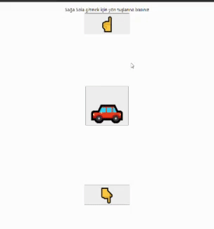

Clarusway

  
 

# CC-01 : React Event Challenge

## Description
This is a React application designed to showcase the handling of keyboard and mouse events. The application features a moving object that responds to arrow key presses and mouse clicks.

## Expected Outcome

## Installation
To run this application locally, follow these steps:

1. Clone this repository to your local machine.
2. Navigate to the project directory.
3. Install dependencies by running `npm install` or `yarn install`.
4. Start the development server with `npm start` or `yarn start`.
5. Open your browser and visit `http://localhost:3000`.

## Usage
Once the application is running, you can control the movement of the object using the following methods:

- **Keyboard Events:**

  - Press the **left arrow** key to move the object to the left.
  - Press the **right arrow** key to move the object to the right.

- **Mouse Events:**

  - Click on the ☝ button to perform action shown in the gif.
  - Click on the 👇 button to perform action shown in the gif.

## Implementation

The object's movement is managed through React event listeners. Both keyboard and mouse events trigger actions that update the object's position or execute specific tasks.

## Technologies Used
- React
- JavaScript

## Note
- You have the flexibility to use different objects and enhance both the actions and the user interface according to your preferences and requirements.
